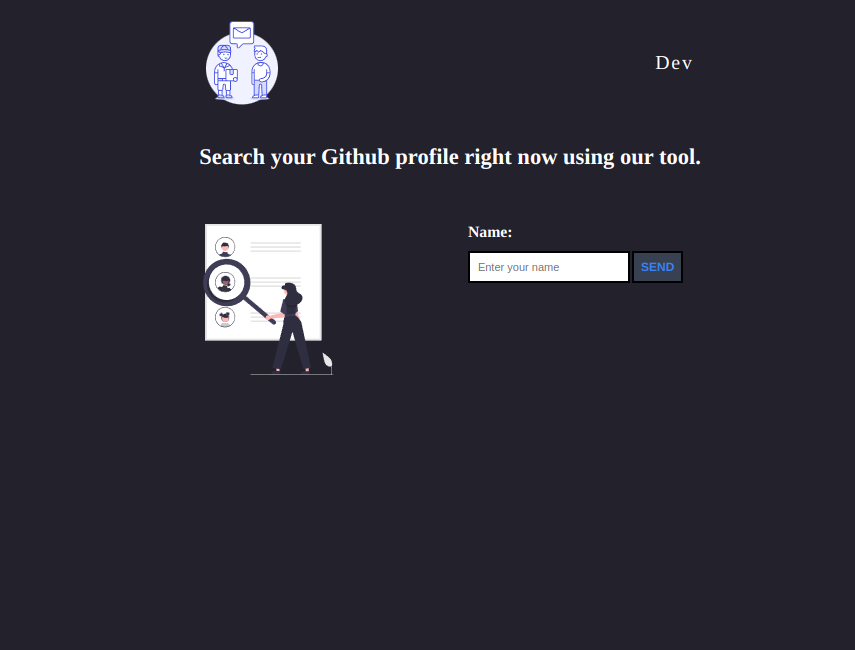
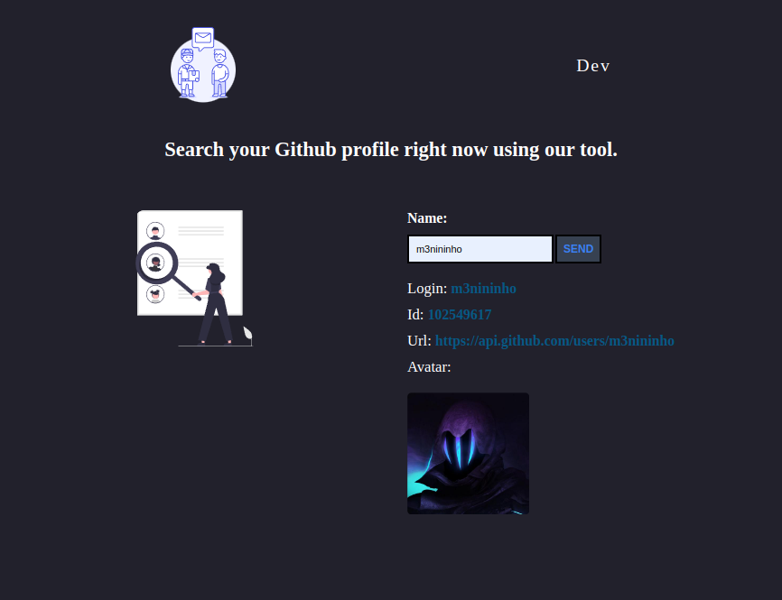

<h1 align="center"> Consumindo API do Github </h1>

 

<h3 align="center">Tela inicial</h3>

 
  

## 🚀 Tecnologias

Esse projeto foi desenvolvido com as seguintes tecnologias:

- HTML e CSS
- JavaScript

 
<h3 align="center">Consulta realizada:</h3>

 
  

 

## 💻 Projeto

O projeto foi desenvolvido para realizar práticas das tecnologias utilizadas. Também foi consumido a API do Github, para pesquisar os usuários e as informações selecionadas.